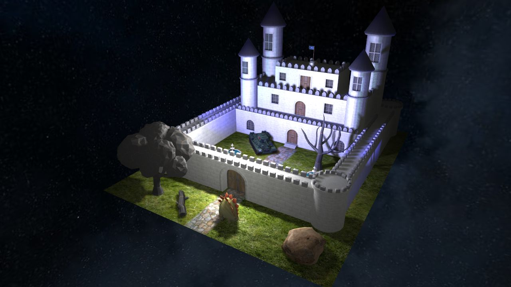
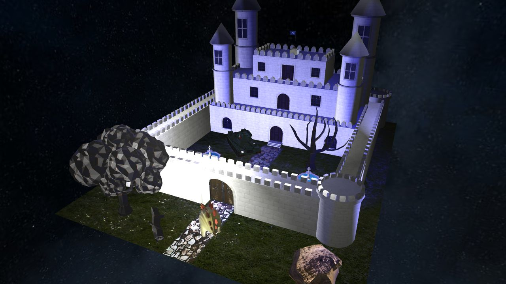

# RG projekat
Projekat iz predmeta Racunarska grafika. 

  
  

## Implementirane oblasti
- Grupa A: Anti Aliasing, Cubemaps
- Grupa B: Point Shadows, Normal Mapping (promena moda je na N)

## Korisceni modeli
https://free3d.com/3d-model/fantasy-castle-40715.html  
https://sankichi.itch.io/stegosaurus  
https://geeksagon.itch.io/t-34-voxel  
https://www.cgtrader.com/free-3d-models/exterior/landscape/tree-pack-029300fc-98fe-469b-b688-bb7f8189c70f  
https://www.cleanpng.com/png-space-skybox-texture-mapping-cube-mapping-night-sk-776480/  
